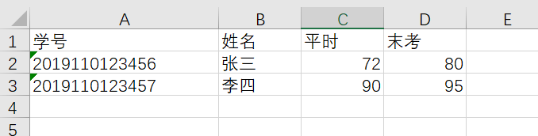

# easy-fill
ease-fill is a chrome extension for fast data entry (GDBTU only). It won't modify any data or have any side effects. It just finds out the matched records and fills with the scores. 

## Usage

### Step 1

Prepare an excel file with formatted data. The first row **MUST** constain "学号", "姓名", "平时" and "末考". Here is an example.

### Step 2

Open the website page and upload the excel file. Parse the excel file.

### Step 3

Click "fill" button. The extension will compare "学号" and "姓名" with the record. If one of them doesn't match the record, the scores won't be filled.