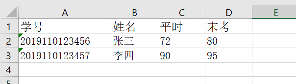
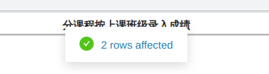

# Easy Fill

Ease Fill is a chrome extension for fast data entry (GDBTU only). 
It fills out the web page form with the scores according to the matched records in the excel file. 

## Usage

### Step 1

Prepare an excel file with formatted data. The first row **MUST** constain "学号", "姓名", "平时" and "末考". Here is an example.

### Step 2

Open the web page and click the smiley button at the top-right corner. Upload the excel file.

A tip will show at the top when the process is done.

